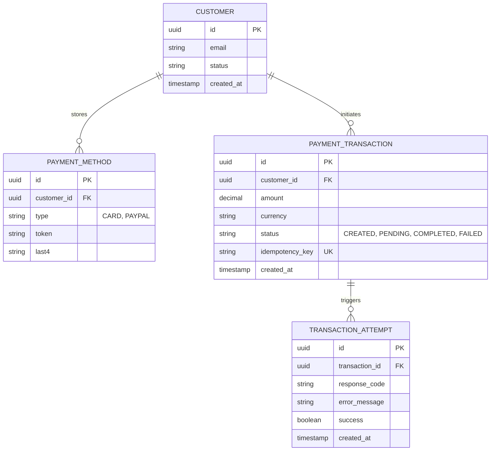

    ## 🏗 Architecture Decisions

### 1. Hexagonal Architecture 
I chose this pattern to strictly decouple the **Domain Logic** (Core) from the **Infrastructure**.
- **Benefit:** We can swap PostgreSQL for MongoDB or Redis without touching a single line of business logic.
- **Proof:** The `domain` package has zero dependencies on Spring Boot or Hibernate.

### 2. Domain-Driven Design (DDD)
- **Rich Domain Model:** Validation happens inside the Domain Service, ensuring no invalid state ever reaches the database.
- **Use Cases:** Interaction is defined via specific interfaces (e.g., `ProcessPaymentUseCase`), not generic Service classes.